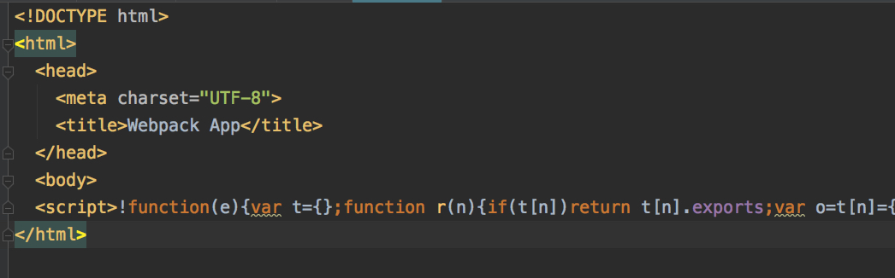

JavaScript Webpack "script-ext-html-webpack-plugin" Demo
========================================================

Webpack默认的情况下，会生成一个html文件并包含对`bundle.js`的引用。
或者，如何使用了`template`指定了文件，则会向它inject一个`<script src="bundle.js"></script>`。

而`script-ext-html-webpack-plugin`插件的作用是，给了我们更多的控制，可以修改这条引用`bundle.js`的方式。
比如可以给它增加`async`属性，甚至可以直接`inline`生成的代码。

```
npm install
npm run demo
```

它将生成一个`index.html`文件。可以打开它，看到它内嵌的代码：


